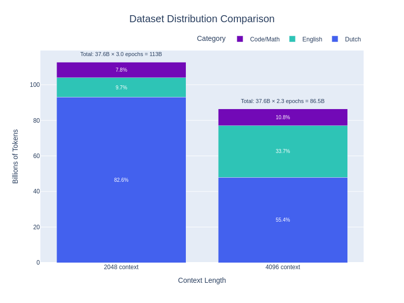
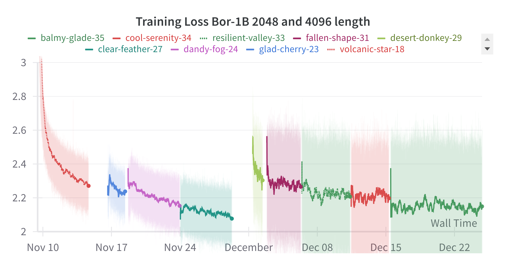

# Bor-1B - Dutch/English Pre-trained Language Model

## Model Description


Bor-1B is a pre-trained multilingual language model based on the Mistral architecture, specifically designed for Dutch and English language processing. The model was pre-trained in two phases with different context lengths and dataset compositions.

The model's name pays homage to "Bor de Wolf" from the beloved Dutch children's series De Fabeltjeskrant (1968-1989). While the original Bor was famous for his signature "Huuuuu!" howl echoing through the forest, this Bor's howls are more subtle - processing Dutch and English text without disturbing the neighbors!

<div style="clear: both;"></div>

## Architecture
The Mistral architecture was chosen for its broad library support and efficient implementation. The Bor-1B model maintains Mistral's core structural elements while scaling down dimensions for a more compact design:

- **Model Scale**: ~1.19B parameters vs Mistral's 7B, primarily due to reduced width:
  - Hidden size: 1536 vs 4096
  - Intermediate MLP size: 6144 vs 14336
  - Attention heads remain at 32 with 8 KV heads (4:1 grouping ratio)
  - Layer depth maintained at 32 layers

- **Key Similarities**:
  - Sliding window attention (4096 tokens)
  - Vocabulary size (32K tokens)
  - Number of attention heads and KV heads
  - Model depth (32 layers)
  - Basic architecture components (RMSNorm, SiLU activation)

- **RoPE**:
  - A higher RoPE base frequency (θ = 80000 vs Mistral v0.1's 10000) was chosen to potentially improve extrapolation to sequences longer than those seen during training.

## Tokenizer
The model uses the [dutch-llama-tokenizer](https://huggingface.co/yhavinga/dutch-llama-tokenizer), a 32K BPE tokenizer specifically optimized for Dutch-English bilingual content and code. This tokenizer was selected for its optimal balance between:

1. Efficient tokenization of Dutch text (comparable to specialized Dutch tokenizers)
2. Strong performance on English and code
3. Compact vocabulary size (32K tokens) suitable for smaller models
4. Comprehensive character coverage including special characters for code and math

Benchmarks show it achieves tokenization efficiency within 5-10% of specialized single-language tokenizers while maintaining a vocabulary size appropriate for 1-2B parameter models. For mixed Dutch-English-code content, it typically requires 10-15% fewer tokens than general-purpose tokenizers like Mistral's.

## Training Data

The model was trained in two phases with different context lengths and dataset compositions:



### Phase 1 (2048 context length)
Total tokens: 37.6B tokens × 3 epochs = 113B total
- Primary Dutch content (~82%): [MC4 Dutch Cleaned](https://huggingface.co/datasets/yhavinga/mc4_nl_cleaned), Wikipedia,
 [GeminiPhiDutch](https://huggingface.co/datasets/Kalamazooter/GeminiPhiDutch) and additional Dutch datasets
- English content (~12%) from curated sources, including [goodwiki](https://huggingface.co/datasets/euirim/goodwiki)
- Python code (~6%) for programming capabilities: Python subsets from [CodeSearchNet](https://huggingface.co/datasets/code-search-net/code_search_net) and [github-code-clean](https://huggingface.co/datasets/codeparrot/github-code-clean/viewer/Python-all)

### Phase 2 (4096 context length)
Total tokens: 37.6B tokens × 2.3 epochs = 87B total
- Balanced composition: Dutch (55%), English (34%), and specialized content (~11%)
- Dutch content: [MC4 Dutch Cleaned](https://huggingface.co/datasets/yhavinga/mc4_nl_cleaned), Wikipedia,
 [GeminiPhiDutch](https://huggingface.co/datasets/Kalamazooter/GeminiPhiDutch), [CulturaX Dutch](https://huggingface.co/datasets/uonlp/CulturaX/viewer/nl)(*)
- English content: [Zyda-2](https://huggingface.co/datasets/Zyphra/Zyda-2), [goodwiki](https://huggingface.co/datasets/euirim/goodwiki) and additional curated sources
- Code and mathematics (~10%): Python from [CodeSearchNet](https://huggingface.co/datasets/code-search-net/code_search_net) and [github-code-clean](https://huggingface.co/datasets/codeparrot/github-code-clean/viewer/Python-all), plus [FineWeb-math](https://huggingface.co/datasets/OpenCoder-LLM/opc-fineweb-math-corpus) and [FineWeb-code](https://huggingface.co/datasets/OpenCoder-LLM/opc-fineweb-code-corpus)
- Instruction tuning (~2%): [OpenHermes 2.5](https://huggingface.co/datasets/teknium/OpenHermes-2.5) (85%) and [OpenHermes 2.5 Dutch](https://huggingface.co/datasets/yhavinga/Openhermes-2.5-dutch-46k) (15%)

The second phase features a more balanced language distribution and enhanced code/mathematics representation to improve the model's capabilities across natural language and technical tasks.

## Training Details

### Hardware and Infrastructure
- Training hardware: TPU v4-32
- Training duration: 45 days (Nov 10 - Dec 24, 2023)

### Training Configuration
Common settings:
- Optimizer: AdamW (β1=0.92, β2=0.999, ε=1e-7)
- Weight decay: 0.1
- Z-loss: 0.0001
- Precision: bfloat16
- Attention implementation: sharded vanilla attention

Phase 1 (2048 context):
- Batch size: 128 (gradient accumulation: 2)
- Learning rate: 3e-4 → 5e-5 (linear decay)
- Warmup steps: 4000
- Training epochs: 2 (37B tokens × 3 epochs = 112B tokens)
- Max gradient norm: 0.7

Phase 2 (4096 context):
- Batch size: 32 (gradient accumulation: 8)
- Learning rate: 1.5e-4 → 3e-5 (linear decay)
- Warmup steps: 10000
- Training epochs: 1 (37B tokens × 2.4 epochs = 87B tokens)
- Max gradient norm: 1.0

### Training Dynamics
Training required multiple restarts due to software and infrastructure constraints, resulting in repeated learning rate warmups visible in the loss curves. Despite these interruptions, the model demonstrated stable convergence:



- Final training loss stabilized around 2.1-2.2 after initial optimization
- Phase 2 (4096 context) shows higher loss, most likely due to dataset composition:
  - More diverse content mix (34% English vs 12% in Phase 1, inclusion of CulturaX for Dutch)
  - More of technical content (mathematics, code)
- Multiple warmup cycles visible but maintained consistent loss levels

## Intended Use
- Rapid experimentation with Mistral architecture for Dutch/English tasks
- Single-task fine-tuning (e.g., text simplification, translation) where context contains all necessary information
- Research and development of Dutch language capabilities
- Lightweight applications requiring basic Dutch/English understanding

## Data Considerations and Limitations
- Tiny model size by current standards (~1.19B parameters and 0.2T tokens trained on) limits complex reasoning and generation capabilities
- Not suitable for high-quality chat responses from simple prompts
- Best performance achieved when full context/information is provided in the prompt
- Performance may vary between Dutch and English
- Domain-specific performance depends on training data distribution
- Model behaviors inherit biases present in training data
- Architectural choice of maintaining 32 layers results in suboptimal inference speed for the parameter count
- As parts of the training data (CulturaX, MC4) are derived from CommonCrawl, the model may have been exposed to personal or sensitive information despite cleaning efforts

## License

### Model License
This model and its weights are licensed under the [Apache License 2.0](https://www.apache.org/licenses/LICENSE-2.0).

### Dataset Licenses
The training data includes content from multiple sources with different licenses:

- **CulturaX**: Inherits licenses from:
  - [mC4 license](https://huggingface.co/datasets/allenai/c4#license)
  - [OSCAR license](https://huggingface.co/datasets/oscar-corpus/OSCAR-2301#licensing-information)
- **MC4-NL-cleaned**: ODC-BY license, subject to Common Crawl terms of use
- Additional datasets: See respective repository licenses

## Citations

If you use this model, please cite both the model and relevant datasets:

```bibtex
@article{2019t5,
    author        = {Colin Raffel and Noam Shazeer and Adam Roberts and Katherine Lee and
                     Sharan Narang and Michael Matena and Yanqi Zhou and Wei Li and
                     Peter J. Liu},
    title         = {Exploring the Limits of Transfer Learning with a Unified 
                     Text-to-Text Transformer},
    journal       = {arXiv e-prints},
    year          = {2019},
    archivePrefix = {arXiv},
    eprint        = {1910.10683}
}

@article{husain2019codesearchnet,
    title        = {{CodeSearchNet} Challenge: Evaluating the State of Semantic Code Search},
    author       = {Husain, Hamel and Wu, Ho-Hsiang and Gazit, Tiferet and
                    Allamanis, Miltiadis and Brockschmidt, Marc},
    journal      = {arXiv preprint arXiv:1909.09436},
    year         = {2019}
}

@misc{Zare_Chavoshi_2023,
    title        = {EasyDeL, an Open-Source Library for Enhanced Training of JAX/Flax Models},
    url          = {https://github.com/erfanzar/EasyDeL},
    journal      = {EasyDeL Easy and Fast DeepLearning with JAX},
    publisher    = {Erfan Zare Chavoshi},
    author       = {Zare Chavoshi, Erfan},
    year         = {2023}
}

@misc{GoodWiki,
    title        = {GoodWiki Dataset},
    author       = {Choi, Euirim},
    howpublished = {\url{https://www.github.com/euirim/goodwiki}},
    month        = {September},
    year         = {2023}
}

@inproceedings{nguyen-etal-2024-culturax,
    title     = "{C}ultura{X}: A Cleaned, Enormous, and Multilingual Dataset for Large 
                 Language Models in 167 Languages",
    author    = "Nguyen, Thuat and others",
    booktitle = "Proceedings of the 2024 Joint International Conference on Computational 
                 Linguistics, Language Resources and Evaluation (LREC-COLING 2024)",
    year      = "2024",
    pages     = "4226--4237"
}


@inproceedings{Huang2024OpenCoderTO,
    title        = {OpenCoder: The Open Cookbook for Top-Tier Code Large Language Models},
    author       = {Huang, Siming and Cheng, Tianhao and Liu, Jason Klein and
                    Hao, Jiaran and Song, Liuyihan and Xu, Yang and Yang, J. and
                    Liu, J. H. and Zhang, Chenchen and Chai, Linzheng and
                    Yuan, Ruifeng and Zhang, Zhaoxiang and Fu, Jie and Liu, Qian and
                    Zhang, Ge and Wang, Zili and Qi, Yuan and Xu, Yinghui and
                    Chu, Wei},
    year         = {2024},
    url          = {https://arxiv.org/pdf/2411.04905}
}
```

## Acknowledgements

This project would not have been possible without compute generously provided by Google through the [TPU Research Cloud](https://sites.research.google/trc/). Training was implemented using [EasyDeL](https://erfanzar.github.io/EasyDeL/), an Apache v2 licensed open-source framework for efficient training of language models on TPU/GPU with JAX/Flax.

Created by [Yeb Havinga](https://www.linkedin.com/in/yeb-havinga-86530825/)
